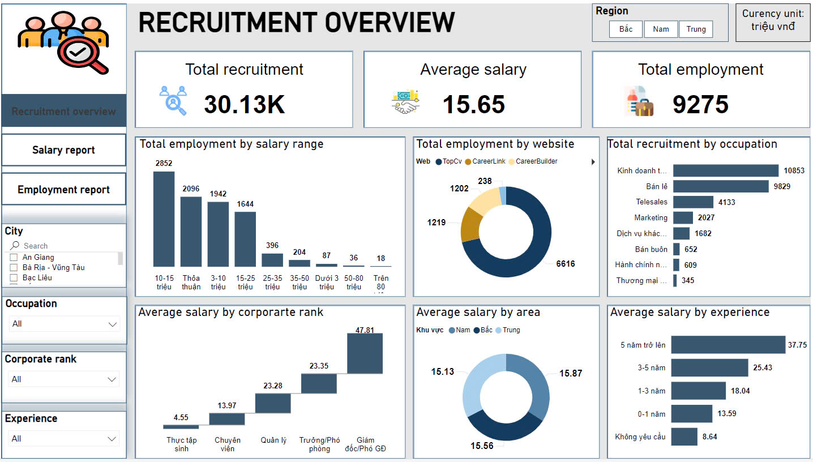

<h2> PERSONAL PROJECT: RECRUITMENT ANALYTICS </h2>

<h2>1. Objective</h2>

   Recruitment data is a collection of information related to human resource recruitment, aimed at providing both workers and businesses with an overview of the labor market situation.

<h2>2. Approach</h2>
<ul>
   <li><strong>Data Collecting:</strong> Crawl data from recruitment websites using Octoparse.</li>
   <li><strong>Data Processing:</strong> Store data in MySQL Workbench and perform data ETL.</li>
   <li><strong>Data Warehouse:</strong> Create Dimension and Fact tables and load the cleaned data into them.</li>
   <li><strong>Data Visualization:</strong> Connect Power BI to MySQL Workbench to create visual reports.</li>
   <li><strong>Decision-Making:</strong> Analyze the reports to gain a more visual insight into the labor market, in order to support workers in making better decisions.</li>
</ul>

<h2>3. Result</h2>

   From the report, we get many different perspectives and evaluations of job postings. Through the report, we can know the average salary, required skills, career opportunities in each region and market demand for candidates field of business and sales... This information allows us to make informed decisions about our future career path and identify the knowledge we need to meet job requirements.

   Additionally, from the dashboard we can choose to view data as we want. This helps us compare the differences between each position, experience and industry.

  

